>  style="width:0.57778in;height:0.38161in" /> style="width:0.57778in;height:0.38161in" /> style="width:0.57778in;height:0.38161in" /> style="width:0.57778in;height:0.38161in" /> style="width:0.47222in;height:0.47158in" />[International Journal
> of](https://www.mdpi.com/journal/ijms) [***Molecular***
> ***Sciences***](https://www.mdpi.com/journal/ijms) style="width:0.7874in;height:0.27559in" />

Article

> **Physical** **Considerations** **for** **In** **Vitro** **ESWT**
> **Research** **Design**
>
> **Cyrill** **Slezak** **1,2,3,** **Roland** **Rose** **2,3,4,**
> **Julia** **M.** **Jilge** **2,5,** **Robert** **Nuster** [**6**
> **,**](https://orcid.org/0000-0001-6446-8057) **David** **Hercher**
> **2,**[**3**](https://orcid.org/0000-0001-5928-9492) **and** **Paul**
> **Slezak** **2,3,\***
>
> 1 Department of Physics, Utah Valley University, Orem, UT 84059, USA;
> CSlezak@uvu.edu
>
> 2 Ludwig Boltzmann Institute for Experimental and Clinical
> Traumatology, AUVA Research Center, 1200 Vienna, Austria;
> roland.rose@protonmail.com (R.R.); julia.jilge@trauma.lbg.ac.at
> (J.M.J.); david.hercher@trauma.lbg.ac.at (D.H.)
>
> 3 Austrian Cluster for Tissue Regeneration, 1200 Vienna, Austria
>
> 4 Department of Life Science Engineering, University of Applied
> Sciences Technikum Wien, 1200 Vienna, Austria
>
> 5 University of Veterinary Medicine Vienna, 1210 Vienna, Austria
>
> 6 Department of Physics, University of Graz, 8010 Graz, Austria;
> ro.nuster@uni-graz.at **\*** Correspondence:
> Paul.Slezak@trauma.lbg.ac.at
>
> [€‚ƒ„…†](https://www.mdpi.com/article/10.3390/ijms23010313?type=check_update&version=2)
>
> **Citation:** Slezak, C.; Rose, R.; Jilge, J.M.; Nuster, R.; Hercher,
> D.; Slezak, P. Physical Considerations for In Vitro ESWT Research
> Design. Int. J. Mol. Sci. **2022**, 23, 313.
> [https://doi.org/](https://doi.org/10.3390/ijms23010313)
> [10.3390/ijms23010313](https://doi.org/10.3390/ijms23010313)
>
> Academic Editor: Carlo Ventura
>
> Received: 30 November 2021 Accepted: 25 December 2021 Published: 28
> December 2021
>
> **Publisher’sNote:** MDPIstaysneutral with regard to jurisdictional
> claims in published maps and institutional affil-iations.
>
> **Copyright:** © 2021 by the authors. Licensee MDPI, Basel,
> Switzerland. This article is an open access article distributed under
> the terms and conditions of the Creative Commons Attribution (CC BY)
> license [(https://](https://creativecommons.org/licenses/by/4.0/)
> [creativecommons.org/licenses/by/](https://creativecommons.org/licenses/by/4.0/)
>
> 4.0/).
>
> **Abstract:** In vitro investigations, which comprise the bulk of
> research efforts geared at identifying an underlying biomechanical
> mechanism for extracorporeal shock wave therapy (ESWT), are commonly
> hampered by inadequate descriptions of the underlying therapeutic
> acoustical pressure waves. We demonstrate the necessity of in-situ
> sound pressure measurements inside the treated samples considering the
> significant differences associated with available applicator
> technologies and cell containment. A statistical analysis of
> pulse-to-pulse variability in an electrohydraulic applicator yields a
> recommendation for a minimal pulse number of n = 300 for cell pallets
> and suspensions to achieve reproducible treatments. Non-linear
> absorption behavior of sample holders and boundary effects are shown
> for transient peak pressures and applied energies and may serve as a
> guide when
> in-situmeasurementsarenotavailableorcanbeusedasacontrollableexperimentaldesignfactor.
> For the use in microbiological investigations of ESWT we provide
> actionable identification of common problems in describing physical
> shockwave parameters and improving experimental setups by; (1)
> promoting in-situ sound field measurements, (2) statistical evaluation
> of applicator variability, and (3) extrapolation of treatment
> parameters based on focal and treatment volumes.
>
> **Keywords:** shockwave therapy; regenerative medicine; sedimentation;
> in vitro
>
> **1.** **Introduction**
>
> Overthelast30years,extracorporealshockwavetherapy(ESWT)hasestablisheditself
> as a viable treatment option for a wide range of clinical indications.
> It has distinguished itself for its safe, non-invasive approach in
> regenerative medicine \[1\] when it adheres to established protocols.
> A well-established wide range of indications like non-union fractures,
> some tendinopathies, and chronic non-healing wounds is continuously
> expanded by new experimental investigations into novel indications in
> urology, peripheral nerve regeneration, spinal cord injury, and
> trans-cranial applications \[2–11\].
>
> Clinical successes lead to the massive need for bedside-to-bench
> research seeking insights into the underlying biomechanical
> interactions, which constitute the foundation of the respective
> treatments’ regenerative potential. Active in vitro experimentation
> alongside pre-clinical animal models are establishing a direct link
> between physical parameters of shockwaves and corresponding biological
> responses, which can be further correlated with clinical outcomes.
> This search for a fundamental mechanistic understanding of underlying
> regenerative mechanisms, however, remains elusive \[12–14\]. Possible
> working mechanisms have been proposed and investigated \[15,16\], but
> many basic science results have been shown to suffer from
> poor-documentation and irreproducibility \[17,18\].
>
> Int. J. Mol. Sci. **2022**, 23, 313.
> <https://doi.org/10.3390/ijms23010313>
> <https://www.mdpi.com/journal/ijms>

Int. J. Mol. Sci. **2022**, 23, 313 2 of 16

> A complete and detailed description of the applied acoustical fields is
> essential for the investigation of mechanobiology and cellular
> mechanosensing. Currently, there is no clear causal link between
> specific physical parameters such as peak pressure or pulse energy and
> any specific cellular response, but rather only a cumulative effect of
> the entire shockwave. The characterization of the applied sound fields
> is often incomplete, and the used parameters are restricted to the
> technical settings of the applicators \[17,19\]. This is particularly
> problematic as the requirements for approval of medical shockwave
> devices by regulatory agencies are based on dated standards derived
> from ultrasound devices and applications \[20\]. There, one of the
> main safety aspects for patients is the time-averaged energy
> deposition within the tissue. However, the clinical use of ESWT is
> limited to a few pulses (usually less than 10 per second) rather than
> a continual signal, and as such, the total power is insignificant at
> comparable pulse pressures. Therefore, documented settings provide
> researchers with upper safety thresholds but only limited information
> about actually applied therapies.
>
> Most commonly reported parameters describing in vitro setups have
> focussed on peak pulse pressure, pulse intensity integral (also
> referred to as energy flux density), and pulse repetition frequency
> \[21\]. These can be thought of as envelope parameters, providing
> ranges and summative reference values of the pressure-time waveform
> but do not allow for any insight into its actual shape. Additional
> corresponding geometric sound field parame-ters which may be readily
> obtained indirectly through the listed manufacturers include the 6 dB
> and the 5 MPa zones. These correspond to focal volumes of peak
> pressures exceeding 50% of the maximum peak pressure and those
> exceeding the 5 MPa threshold, respectively \[22\]. It is noteworthy
> that all these geometric descriptors only provide sum-mative (for
> energies) or maximal (for pressures) values and none of the waveforms
> (time evolution of the pressure) themselves. As such, all observed
> biological in vitro effects have only been correlated to this limited
> set of physical parameters, absent any indication of causality or even
> suggestion of a physical mechanism \[17,23\].
>
> This paper provides a systematic approach to in vitro research design
> using electro-hydraulic ESWT in adapting the physical
> characterizations of lithotripter experiments into the low- to
> mid-energy regime. In particular, we present a complete description
> beginning from a visualization of the applied pressure waves, provide
> a statistical analysis of the applied treatments, evaluate the impact
> of the cell containers on the pressure field, and validate the use of
> cell pellets and sedimentation in suspension samples. The detailed
> approach allows for the adoption by research groups with limited
> technical (physical) experience and resources while maintaining a
> controlled treatment environment. This will hopefully lead to an
> increase in the reproducibility of future biological experiments using
> ESWT.
>
> **2.** **Results**
>
> Regulatorycompliantfree-fieldmeasurements(suchasIEC61846)forelectrohydraulic
> devices can differ widely from the actual use of the device in in
> vitro setups. In full therapy sessions, up to several hundred pulses
> are applied to the study sample in rapid succession (application
> frequency). Of particular interest in this setting is the
> pulse-to-pulse variability withinthetherapy.
> Duetoboththeregulatoryrequirementandtheirpredominantreporting
> intheliterature, thepulsepeakpressure pmax andpeakintegralintensity
> PII, oftenreferred to as energy flux density over the focal zone, are
> of special interest. Although PII can be differentiated only taking
> into account positive or negative wave-components, we consider the
> total waveform and define
>
> Z
>
> PII = *r*c p2(t)dt
>
> where *r* is the mass density of the medium, c the speed of wave
> propagation, and p(t) is the measured time-dependent pressure.
>
> is the measured time-dependent pressure.
>
>  style="width:7.43325in;height:2.7335in" />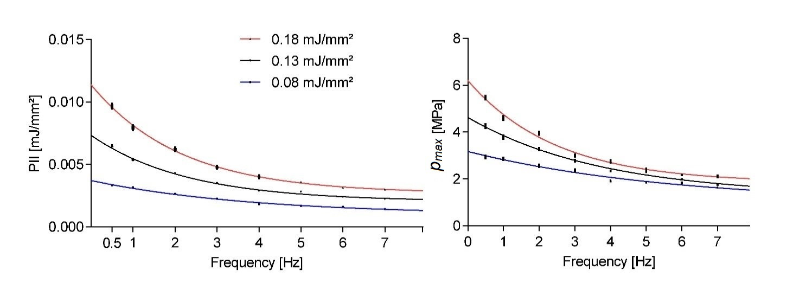 style="width:7.43325in;height:2.7335in" />Figure 1 shows the pulse
> repetition frequency dependent peak pressures and PII for awhere 𝜌 is
> the mass density of the medium, 𝑐sthe speed of wave propagation, and
> 𝑝(𝑡) statistical valu**e**s and associated standard error of the mean.
> Therapy sessions comprised

Int. J. Mol. Sci. **2022**, 23, 313 300 shots utilizing
antOP155sapplicator as evaluated by a point measurement inside ther
focus volume at a fixed location for all measurements. The three
evaluated energy s**e**ttings rstatisticalrvalues and associated standa
**r**d error of the mean. Therapy sessionsf comprised

> ffgiven nominal machine setting. All results shown in this paper
> indicate the mean statisticalettings srutilizing an OP155 applicator
> as evaluated by a point measurement inside the focus volume means
>
> at a fixed location for all measurements. The three evaluated energy
> settings reflect most
>
> fof the applicator’s energy range. None of the evaluated parameter
> means approached the rved a
>
> snominative values even in the extrapolated single shot limit (i.e.,
> frequency approached zero). As the application frequency was
> increased, we observed a strong exponentially
>
> decaying sound field strength.
>
> **Figure** **1.** Evaluation of pulse integral intensity (PII) and
> maximum pulse pressure (*pmax*) at nominal machine settings at various
> application pulse repetition frequencies. Error bars shown indicate
> the st**Figure** **1.** Evaluation of pulse integral intensity (PII)
> and maximum pulse pressure (pmax) at nominal
>
> 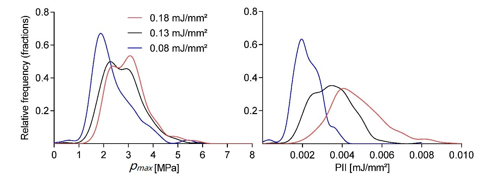 style="width:7.21508in;height:2.59142in" /> style="width:7.21508in;height:2.59142in" />machine settings at various
> application pulse repetition frequencies. Error bars shown indicate
> the machineisettingstat various application
> pulsetrepetitionifrequencies. Error bars shown indicate the
>
> over 1200 shots at a fixed application frequency of 3 Hz. There was a
> fairly strong cut-off for peak pressures below 1 MPa regardless of
> energy setting, while comparable high peake pressures could also be
> found inthe high-end tail. There was a significant overlapbetweens
> thpressures could also be found in the high-end tail. There was a
> significant overlap between en**t**edf ifthe three energy settings, but
> a distinct separation of the means, as already documented in h peak
>
> pressures could also be found inthe high-end tail. There was a
> significant overlapbetween the three energy settings, but a distinct
> separation of the means, as already documented in Figure 1.
>
> **Figure** **2.** Normalized smooth histogram of 1200 shots for OP155
> maximum pulse pressure (pmax) and pulse integral intensity (PII)
> measurements at three nominal machine settings and 3 Hz applica-tion
> frequency.
>
> The large variation of the observed individual shockwave pulses raises
> the question as to whether the two subsequent treatments are
> statistically comparable. In order to estimate

Int. J. Mol. Sci. **2022**, 23, 313 4 of
16

> the relative error corresponding to a confidence interval (CI) of any
> expected mean value for a physical parameter from our stochastic
> generator for a given sample size of applied shocks, we employed a
> Monte Carlo (MC) approach implemented in Mathematica (Version 12.0,
> Wolfram, Champaign, IL, USA).
>
> We determined the absolute error *\#* j xn uj for a given CI by
> applying the central
>
> limit theorem n ! *m* = lim xn = åxi
>
> i=1
>
> based on n random therapy samples Yn which are drawn from an
> experimentally deter-
>
> mined distribution Y with mean *m* and standard deviation *s*2. Since
> *m*Y = *m*, we estimate the error *\#* for the 100 (1 )% confidence
> intervals by the corresponding standard
>
> deviation of the absolute errors of Y(Y , Y , Y , Yn ). Minimal
> therapy sample sizes could now be obtained by matching the desired
> error with the appropriate interpolated CI curve.
>
> Figure 3 shows the relative error *\#*rel estimates in the peak
> pressure for CIs of *a* = 0.05, 0.01, 0.001 as a fraction of the
> sample mean *m*. We obtained a probability density function (pdf) from
> the normalized smooth histogram interpolation of 1200 pres-sure
> measurements for an OP155 un-focused applicator at 3 Hz and an energy
> setting of 0.08 mJ/mm2. The MC calculation was based on n = 100,000
> steps for each therapy size. The results indicate a significantly
> larger minimal sample size nss for the desired error *\#* as would be
> obtained by assuming a normalized distribution of pressures
>
> 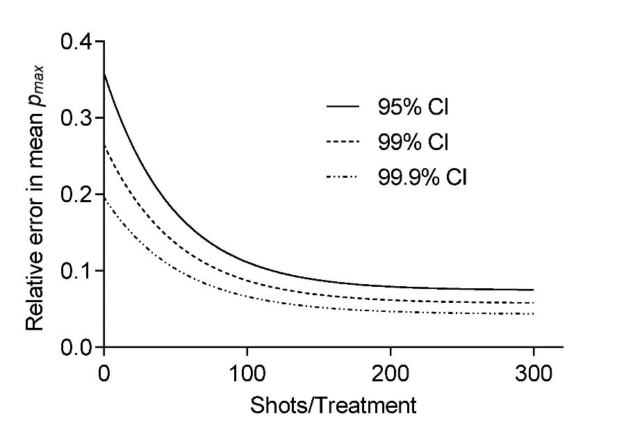 style="width:4.55767in;height:3.15883in" /> *<u>a</u>* 2 nss *\#*2
>
> **Fi** **Figure** **3.** The estimated relative error in the mean
> maximum pulse pressure (p re ) of a)treatmenttment session. Computed
> results for various treatment shot sizes of a Mont Carlo simulation
> based on an experimental probability distribution for three different
> confidence levels are shown.
>
> The results presented up to this point have illustrated the inherent
> variability of the
>
> underlying free-field pulse propagation utilizing a water bath set up
> in the absence of any r the focal zone iof the applicator results in
> pulse reflection and refraction at the said interface.
>
> fiewhile simultaneously mimicking pre-/clinical indications. As such,
> it is desirable to avoidas no propagation of the pressure pulsethrough
> the air column above the sample, (2) essentially perfect reflection of
> the oncoming wave at the air-interface, (3) diffraction effects
> expanding into the volume behind the air volume,tand (4) almost full
> propagation of the incident wave through the sample. Thus, the
> resultant wave pulse treating the sample was fundamentally altered by
> the introduction of the air volume within the container.

Int. J. Mol. Sci. **2022**, 23, 313 **Figure** **3.** The estimated
relative error in the mean maximum pulse pressure (*pmax*) of a
treatment session. Computed results for various treatment shot sizes of
a Mont Carlo simulation based on an ex (i.e., in the study of cell
suspensions) are similar in impedance to water. Such an
approach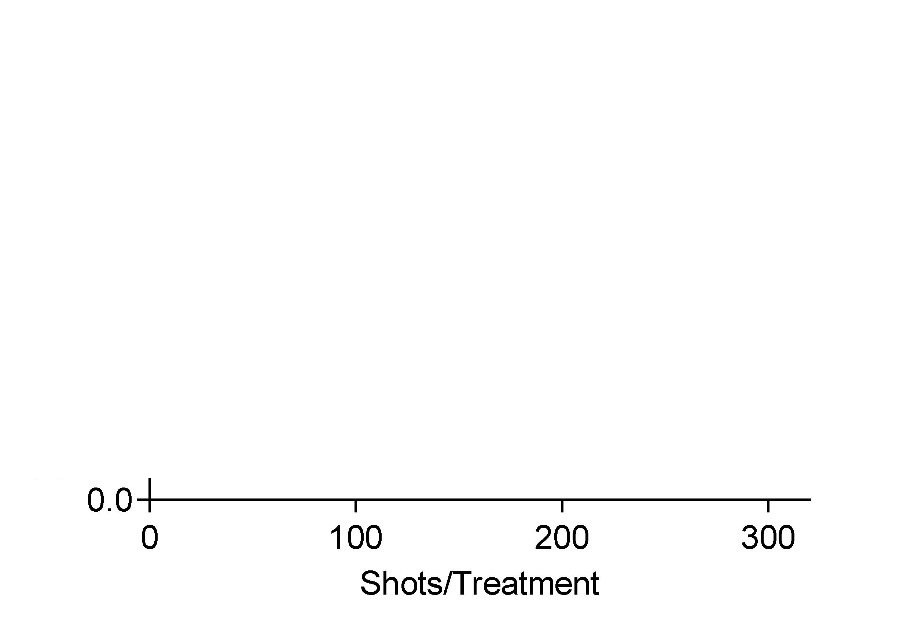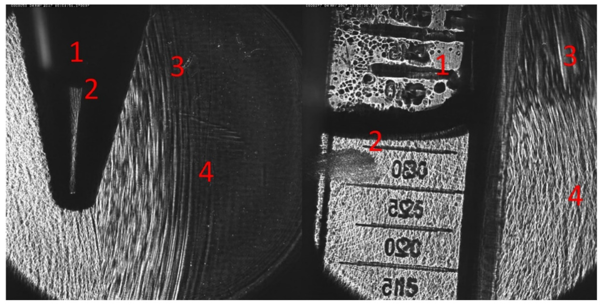

> will largely maintain the free field geometry of the reference bath
> measurements discussed r the focal zone of the applicator results in
> pulse reflection and refraction at the said interface. In focal zone
> of the applicator results in pulse reflection and refraction at
> theisaid interface. Inound fields of partially filled containers
> exhibiting many of the i key features: (1) There was no propagation of
> the pressure pulsethrough the air column above the sample, (2)
> essentially pepropagation of the pressure pulse through the air column
> above the sample, (2) essentiallyffects
>
> perfect reflection of the oncoming wave at the air-interface, (3)
> diffraction effects expanding
>
> into the volume behind the air volume, and (4) almost full propagation
> of the incident wave fu through the sample. Thus, the resultant wave
> pulse treating the sample was fundamentally
>
> **Fi** **Figure** **4.** OPCD images of an electrohydraulic generated
> shockwave front incident on a sample filledample fill10 mL Falcon tubes
> (**left**) and a 25 cm2 cell culture flask (**right**).lNo wave
> propagation is observedion is obthrough air compartments (1) and
> reflected (2), diffracted((3), and transmitted (4)
> wave-componentswave-components are clearly visible abouti
> thetsample-air interface .in the container.
>
> In In ordertto quantify the physical sound parameters of the altered
> shockwave, we havee, we hacontainer, sample, and air volume
> proximity.iFor this purpose, the hydrophone was placedcts of
>
> in the center of the sample volume such that it coincided with the
> free-field focal point of the applicator. Figure 5 depicts the inserted
> pressure probe through a small drill hole in the back of the container
> at the center height of the sample.
>
> The in situ placement of the hydrophone in the in vitro setup allows
> for the systematic investigation of the effects of the sample
> container and its fill-level on the shockwave.
> Figure6showsmaximumpulsepressure(pmax), maximumtensilepressure(pneg),
> andpulse integral intensity (PII) for a 600 shot treatment using the
> OP 155 un-focused applicator at a nominal energy setting of 0.18
> mJ/mm2 and an application frequency of 3 Hz. The hydrophone placement
> is identical for the three investigated scenarios within the measured
> applicator focal volume close to the geometric focal point. We
> compared the shockwave parameters of the free-field measurements to
> those inside a partially (1 mL) and fully filled 15 mL Falcon tube. The
> hydrophone was fixed relative to the applicator and placed at the
> center of the tube at a height of the 0.5 mL fill-level.
>
> the container, sample, and air volume proximity. For this purpose, the
> hydrophone was placed in the center of the sample volume such that it
> coincided with the free-field focal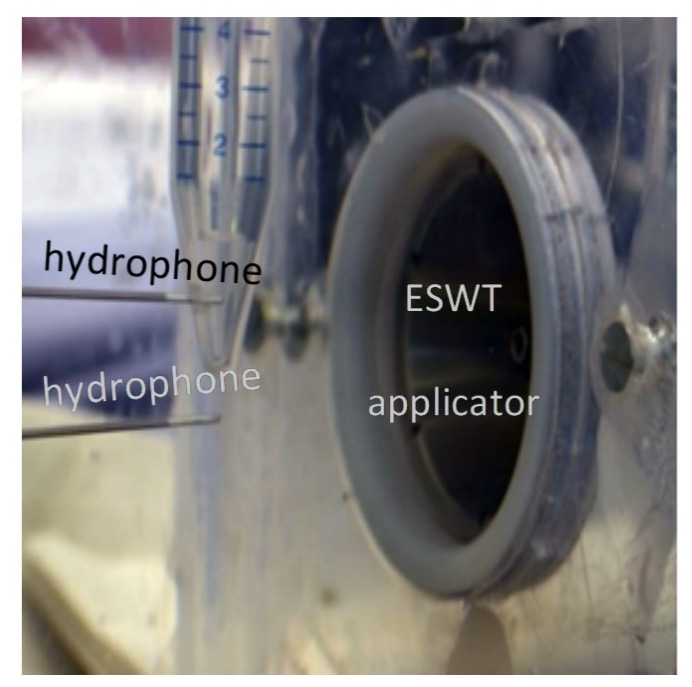 style="width:3.15167in;height:3.1125in" />
>
> Int. J. Mol. Sci. **2022**, 23, 313 point of the applicator. Figure 5
> depicts the inserted pressure probe through a small drill 6 hole in
> the back of the container at the center height of the sample.

*Int.* *J.* *Mol.* *Sci.* **2022**, *22*, x FOR PEER R**FFigure** **5.**
Representative setup of evaluating wave-pressures in the focal zone of
the shockwave
aa**p**plicatoreitherinsidethesamplel(**top**hydrophone)orasafree-fieldreferencemeasurement(**bottom**
(**bottom** hydrophone). Depicted off-axis positions iare
fortillustration purposes only.

> 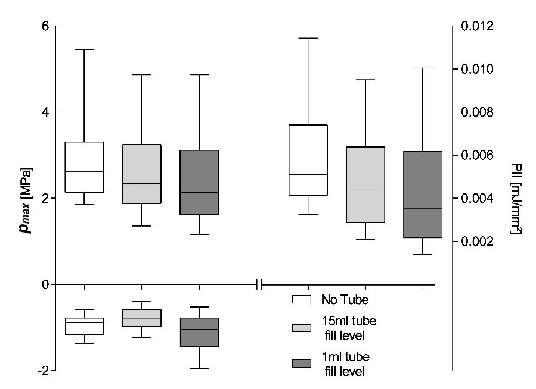 style="width:4.08833in;height:2.97167in" />The in situ placement of
> the hydrophone in the in vitro setup allows for the systematic
> investigation of the effects of the sample container and its
> fill-level on the shockwave. Figure 6 shows maximum pulse pressure
> (*pmax*), maximum tensile pressure (*pneg*), and pulse integral
> intensity (PII) for a 600 shot treatment using the OP 155 un-focused
> applicator at a nominal energy setting of 0.18 mJ/mm2 and an
> application frequency of 3 Hz. The hydrophone placement is identical
> for the three investigated scenarios within the measured applicator
> focal volume close to the geometric focal point. We compared the
> shockwave parameters of the free-field measurements to those inside a
> partially (1 mL) and fully filled 15 mL Falcon tube. The hydrophone
> was fixed relative to the applicator and placed at the center of the
> tube at a height of the 0.5 mL fill-level.
>
> The free-field reference measurements yield a median maximum pulse
> pressure *pmax* = 2.975 ± 0.04909 MPa, maximum tensile pressure *pneg*
> = −0.93 ± 0.011 MPa, and pulse integral intensity PII = 0.006 ± 0.0001
> mJ/mm2. Introducing the cell container reduces all parameters to
> *pmax* = 2.499 ± 0.0492 MPa, *pneg* = −1.119 ± 0.0184 MPa, and PII =
> 0.004 ± 0.0001 mJ/mm2 as a direct result of the tube walls and is
> independent of the fill level. All sample medians are highly
> statistically different (Kruskal–Wallis, *p* \<\< 0.001) and
> individually
>
> **Figure** **6.** Comparison of positive and negative ipeak pressure
> and pulse integral intensity within a in fully and partially filled (1
> mL) 15 mL Falcon tube to a free-field reference (no tube). All sample
> le latteri may not be applicable iff different applicator ienergy
> levels are compared, in which
>
> case resultsrshould only be interpreted in terms of dominance. A
> comparisont of meanse would furthermore be susceptible to high
> energetic outliers, and the possible existence of
>
> ia tthreshold pressure for biological effects (i.e., 5 MPa zone)
> furthermore suggest a rank -and thus lbringing the contained 2air
> interface within the treatment zone, the tensile d pressure is
> essentially doubled due to the phase inversion incurred at the open
> boundary e refill level. All sample medians are highly statistically
> different (Kruskal–Wallis, p \<\< 0.001)
>
> inandindividuallydistinguishable(subsequentpost-hocDunn’smultiplecomparisons).
> Non-o parametric analysis was chosen due to the nature of the
> distribution of generated pulses
>
> (see Figure 4) andra subsequent comparison of the median as the
> distributions were similar. p Note, the latter may not be applicable
> if different applicator energy levels are compared,
>
> using lithotripter \[24\], but significantly larger focal lengths and
> energies make the resultsle
>
> reproducible pulse form generated by this type of applicator allows
> for a systematic investigation of the energy-dependent
> boundary/transmission effects. A similar setup to the previous
> experiment only utilizing completely filled 15 mL Falcon tubes is used
> to eliminate any water/air boundary effects. Figure 7 shows the
> applicator energy-
>
> dependent reduction of peak pressures within a Falcon tube in
> comparison to the free-

Int. J. Mol. Sci. **2022**, 23, 313 7 of
16

> existenceofathresholdpressureforbiologicaleffects(i.e.,5MPazone)furthermoresuggest
> a rank comparison.
>
> The shift of the parameters median to lower values can be attributed
> to a predominant
> lossofhigher-pressurepulses,asevidentbythelowermedianwithintheinterquartilerange.
> By reducing the contained water volume in the Falcon tube to 1 mL and
> thus bringing the contained air interface within the treatment zone,
> the tensile pressure is essentially doubled due to the phase inversion
> incurred at the open boundary reflection. It is important to note that
> this is due to the hydrophone placement with the interface’s pressure
> zone and is absent in the filled tube where the air interface remains
> outside the treatment zone.
>
> 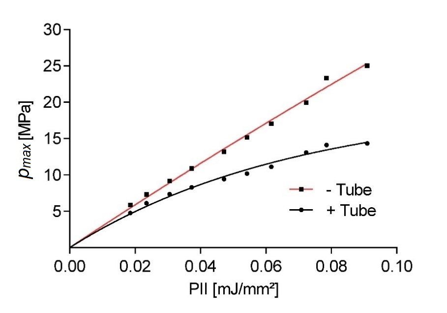 style="width:4.12833in;height:2.89333in" />To gain a better
> understanding of the pressure-dependent pulse attenuation, the peak
> pressure inside a Falcon tube was investigated. Similar work has been
> previously done using lithotripter \[24\], but significantly larger
> focal lengths and energies make the results
> onlymarginallytranslatable.
> Hereweuseanelectromagneticapplicatorasthereproducible pulse form
> generated by this type of applicator allows for a systematic
> investigation of the energy-dependent boundary/transmission effects. A
> similar setup to the previous experiment only utilizing completely
> filled 15 mL Falcon tubes is used to eliminate any water/air boundary
> effects. Figure 7 shows the applicator energy-dependent reduction of
> peak pressures within a Falcon tube in comparison to the free-field
> value. The hydrophone placement is held constant throughout the
> experiment, thus not accounting for any possible lensing/refocusing
> effects of the inserted tube. The measurements show a significant
> reduction of peak pulse pressure of 74.8% for higher pulse pressures,
> while only small changes are observed at lower pressures. The observed
> non-linear behavior is in line with the expected power law-dependent
> absorption of the tube-wall material (15 mL polypropylene centrifuge
> tubes, Greiner Bio-One GmbH, Kremsmünster, Austria).
>
> **Figure** **7.** Comparison of measured peak pulse pressure inside a
> water-filled Falcon tube (black) and d a free-field measurement (red)
> vs. the nominal energy setting of an electromagnet applicator.
>
> The results up to this point have clearly illustrated the necessity
> for in situ evaluation of applied sound fields for in
> vitrotexperiments. However, this point wise evaluation of the
>
> sedimentation within a medium for localizingt thet target cells at the
> tip of a Falcon tube h for best ESWT placeme**n**t. The prevailing
> assumption has been the resulting localization remainOne frequently
> used approach to spatially isolate a sample is to use gravitational
> cell signif**i**cant motion has been observed in larger pellets
> \[17\]. Tolinvestigate the viability of e thfor best ESWT placement.
> The prevailing assumption has been the resulting localization
> saremainsintactdespitethemechanicalimpulsesfromtheshockwaveeventhoughsignificant
> fr motion has been observed in larger pellets \[17\]. To investigate
> the viability of this approach, s time-dependent c**e**ll-density
> measurements of an initially well-mixed sample were taken at sa10 min
> intervals up to 60 min. Vertical stratification was evaluated from four
> surface level
>
> 50 L samples in each Falcon tube starting from the top (a) and spaced
> by subsequently
>
> double cell count analysis via Neubauer counting chamber at each time
> point (*n* = 3 with double readouts). At *t* = 0 min, the cells were
> in a homogeneous emulsion with an associated probability of finding
> 20% of the cells at each sample location (a–e). While over the initial
> 10 min relatively little sedimentation was observed in the bottom
> layer 23% ±
>
> 1.3%, the average cell count doubled (41% ± 11.9%) after 20–30 min.
> Subsequently, the
>
> remains intact despite the mechanical impulses from the shockwave even
> though significant motion has been observed in larger pellets \[17\].
> To investigate the viability of this approach, time-dependent
> cell-density measurements of an initially well-mixed sample were taken
> at 10 min intervals up to 60 min. Vertical stratification was
> evaluated style="width:4.54117in;height:3.18267in" />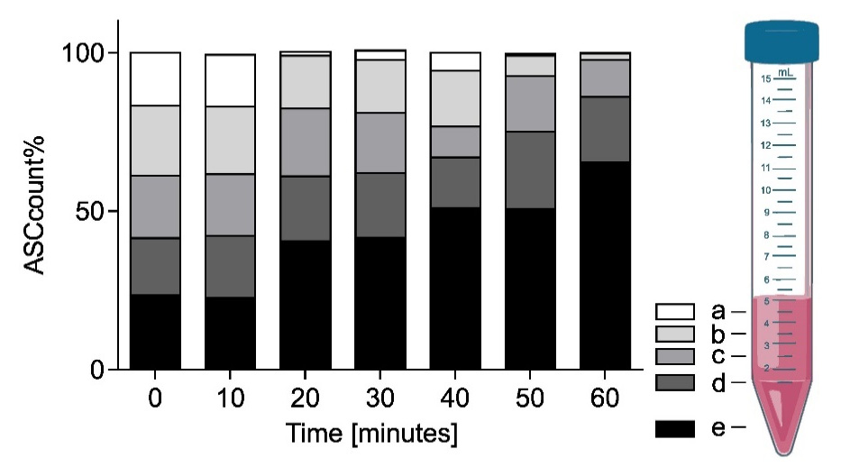 style="width:4.71258in;height:2.59875in" />

Int. J. Mol. Sci. **2022**, 23, 313 from four surface level 50 µL
samples in each Falcon tube starting from the top (a) and spaced by
subsequently discarding of the top 1 mL of the sample (b–d). The final
fifth sample (e) was taken from the bottom of the Falcon tube before
discarding the rest.

> discarding of the top 1 mL of the sample (b–d). The final fifth sample
> (e) was taken fromd on a
>
> double cell count analysis via Neubauer counting chamber at each time
> point (*n* = 3 with doublei readouts). At *t* = 0 min, the acellsCwere
> in a homogeneous emulsion with an
>
> associated probability of finding 20% of the cells at each sample
> location (a–e). While over the initial 10 min relatively little
> sedimentation was observed in the bottom layer 23% ± s over the
> initial 10 min relativelytlittle sedimentation was observed in the
> bottom layerin, half ( the sedimentation and accumulation of cells in
> the bottom slows down. After 40–50 min in the bhalf (51 5.0%) and
> after one hour two thirds (65 7.8%) of the cells were found in the
>
> bottom fraction.
>
> **Figure** **8.** Fractional ASC count over 60 min showing increasing
> sedimentation within a 5 mL sample. Locations (a–e) correspond to 1-mL
> increment fill levels.
>
> While sedimentation effectively accumulates the bulk of the suspended
> cells within the bottom 1 mL of the Falcon tube, it is only a viable
> option for in vitro investigation if no significant mixing occurs due
> to the shockwave application itself. Two sample groups of n =
> 8werepreparedidenticallyforthesedimentationexperimentandrestedforaminimum
> of 40 min, which should render half of the cells in the bottom
> fraction. Subsequently, the Falcon tube was fixed in a water bath,
> placing the focal point of the applicator at the center of the bottom
> 0.5 mL volume. Each group was treated with 300 shockwave pulses at 3
> Hz at the applicator’s highest available energy setting to achieve the
> largest possible agitation. The electromagnetic “Sepia” DUOLITH SD1
> (Storz Medical) at an energy level of 0.55 mJ/mm2 was used for
> group 1. The electrohydraulic OE 50 applicator (Dermagold 100; MTS
> Medical; Germany) at an energy level of 0.27 mJ/mm2 for group 2.
> Stratified samples were taken immediately after the conclusion of the
> treatment analogously to the methodology described previously.
>
> Figure 9 shows the fractional ASC count for each ESWT applicator at
> each of the 5 height levels within the Falcon tube (a–e).
> Post-treatment mixing of the sample was
> observedtobelessthaninthepreviouslyestablished40-minsedimentationlevels.
> Itshould be pointed out that the significantly higher peak pressure of
> the electromagnetic device was restricted to significantly smaller
> volume when compared to the electrohydraulic device, while the latter
> had a sizably smaller peak pressure and a stochastically varying
> (shifting focal volume) field. However, in both applications, we
> observed no net redistribution of cells within the suspension.
>
> should be pointed out that the significantly higher peak pressure of
> the electromagnetic device was restricted to significantly smaller
> volume when compared to the electrohydraulic device, while the latter
> had a sizably smaller peak pressure and a stochastically varying
> (shifting focal volume) field. However, in both applications, we

Int. J. Mol. Sci. **2022**, 23, 313 observed no net redistribution of
cells within the suspension. 9 of 16

> 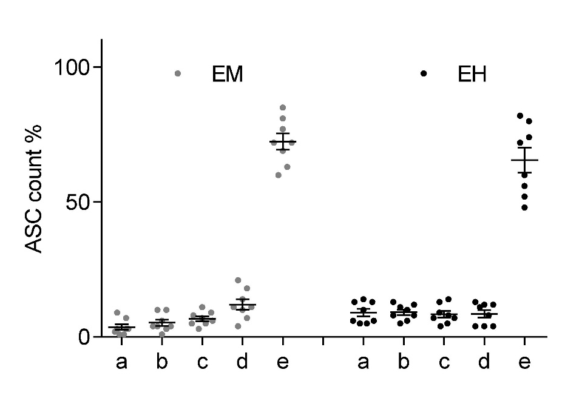**Figure**
> **9.** Fractional ASC count by 1 mL incremented fill-height (a–e)
> within a 15 mL Falcon tube **Fi** after ESWT.iNo significant mixing is
> observed for either electromagnetici(**left**) or electrohydraulic
> after ESWT. No significant mixing is observed for either
> electromagnetic (**left**) or electrohydraulic (**right**) shockwave
> applicators at respective maximum energy settings.
>
> **3.** **Discussion**
>
> **3.** **Disc**One of the key challenges in unlocking a mechanistic
> understanding of ESWT remains
>
> a refined conception of the effects physicalishockwaves have on
> biological systems. Experi-remental in vitro setups strive to provide
> a homogeneous acoustic pressure fieldiwithin the sytreatment zone to
> facilitate the correlation of observed cellular responses. However, we
> field within the treatment zone to facilitate the correlation of
> observed cellular responses.nt H statistical treatment of the
> acoustical field parameters due to their stochastic generating requires
> an inherent statistical treatment of the acoustical rfield parameters
> due to their ly st reproducible field, they lack the possiblelbenefits
> associated with random variations \[25\].
>
> Our measurements systematically documented a significant
> pulse-frequency depen-
>
> dent loss in generated peak pressures and associated energies for
> electrohydraulic appli-cators. There is a well-understood effect of
> generated cavitation leading to peak pressure degradation due to
> energy absorption and wave reflections. This has been mostly studied
> for the refocusing high-energy shockwaves (lithotripters) in the
> treatment zone—the region of concern for in vitro and clinical
> application \[26,27\]. However, we expect the highest levels of
> cavitation bubbles in close proximity of the spark gap and to remain
> enclosed within the generating applicator. Bubbles produced by the
> generated shockwave only partially dissolve in the limited time before
> subsequent shock pulses arrive, thus providing additional nucleation
> sites for further cavitation. Based on our pulse-frequency-dependent
> output measurements, there appears to be a cumulative saturation level
> based on the recovery (dissolve) time, providing a predictive
> dampening of pressures and energies.
>
> While cavitation effects appear to be systematically dependent on
> pulse repletion rate, it does not explain the high inter-pulse
> variability associated with electrohydraulic shock-wave sources. This
> is evident in the statistical spread of pressure and energy
> measurements using single device settings. The observed outcome is a
> combination of effects associated with the spark generation, which
> results in the plasma bubble-induced shockwave forma-tion. For one,
> any spark discharge between two cathodes is a stochastic process and
> the subsequent location and shape of the plasma channel and subsequent
> bubble geometry are indeterminate, arguably exacerbated by the small
> geometries of handheld applicators. Any deviation from a spherical
> shockwave centered about the geometric focus of the reflector
> willresultinablurredrefocusedimagewhichwillhaveapeakpressurecentershiftedaway
> from the geometric focus location. This explains the variation in
> hydrophone peak pressure measurements at the geometric focal point as
> only occasionally a generated shockwave will refocus at the location
> of the hydrophone, thus recording maximum peak pressures.

Int. J. Mol. Sci. **2022**, 23, 313 10 of 16

> For most pulses, the acoustical focus will be found displaced about
> the geometric one, and the hydrophone picks up only a strongly distant
> dependent attenuated signal.
>
> For larger studies, it is essential to account for the variability in
> the generated shock-waves and to assure that within any two or more
> experimental treatment sessions, the applied pulses are statistically
> similar. Figure 3 clearly indicates that even at the desired confidence
> interval CI = 95% and a relative error in the mean peak pressure of
> *\#*rel = 5% requiresaminimumsamplesize nmin =
> 187pulsestoobtaincomparabletreatments. Thisis
> significantlymorethanwouldbeexpectedforanormallydistributedsourcewith
> nmin = 61.
> Itisunreasonabletoobtainalargestatisticalsampleforeachmachinesettingtoobtainareli-able
> probability distribution function as the applicator would show
> significant degradation
> ofthesparkgapelectrodesoverthecourseofthemeasurements.
> Analternativeapproachis to use a bootstrapping approach by which to
> determine the underlying statistics. Obtaining distribution parameters
> using a pseudo-random re-sampling of the measurement data obtained for
> a single treatment can provide additional insight. Using this approach
> to estimate minimum sample sizes on larger data sets (those used in
> Figure 1), we found large variations in distributions. The comparably
> small sample size of only 300 pulses, in general, resulted in
> estimates larger *\#*rel given the same CIs. While individual setups
> can be characterized in this fashion, we recommend, based on our
> findings, that using no less than 300 pulses is preferential. We argue
> that while some applicators and/or settings may require more shots,
> this choice will allow for a high level of confidence for most setups
> while maintaining a manageable treatment time for short duration
> protocols.
>
> Once the treatment parameters are decided, nominal free-field pressure
> and energy reference data for applicator outputs are inadequate for
> describing in vitro setups. Spatial and temporal characteristics of
> the shockwave field are affected by individual setups and therefore
> need to be evaluated in situ. The localized impact of containers,
> media, and air interfaces can only be estimated through involved
> numerical simulations but can readily be measured by in vitro research
> groups. In addition, a direct measurement of the waveform provides
> additional information lost in the envelope parameters (PII, pmax,
> pneg). Pressure gradients, rise and relaxation times, and pulse widths
> are known to be device-specific and may have an effect on treatment
> outcomes. PVDF hydrophones allow for a robust, easily implantable, and
> cost-effective solution, which allows for localized multi-pulse
> evaluation, which cannot be done by often prohibitively priced fiber
> optic sensors. While PVDF
> hydrophonesunderestimatethenegativepressureofthewaveathighpeakpressures,
> these energies are unlikely to be evaluated in vitro outside of
> lithotripsy investigations.
>
> However, while electromagnetic and piezo applicators provide such a
> desired highly reproducible field, it exhibits a strong special
> dependence restricting the recommended treatment zone of the sound
> field to less than half of the 6 dB focal size in the free field. The
> resulting, sometimes restrictedly small volume along with the
> alteration of the local pressure fields due to the incorporation of
> cell containers requires further scrutinization of any setup and
> brings into question the sometimes-argued preferentiality of these
> types of technologies for the use of in vitro investigations \[17\].
>
> Direct in situ measurements are a great step towards standardization,
> but additional spatial considerations need to be included as well.
> Specified parameters for the approx-imately ellipsoidal focal size are
> (1) the 5 MPa zone wherein peak sound field pressures exceed this
> nominal threshold pressure and (2) the 6 dB zone, where local peak
> pressures exceed the half-maximum peak pressure. Both focal volumes
> are highly axially (z-direction) elongated in the order of a factor of
> 10 over their lateral extent (r-radially). The ellipsoidal focal
> volume may be found by Vl = 3*p*r2 2, however a spheroidal
> approximation of
>
> V p = 3*p*r is more suitable for in vitro experimentation where
> samples rarely can take advantage of the lateral extent of the
> acoustic field. In further restricting the treatment zone
>
> to half of the spatial extent of the 6 dB zone for additional
> consistency in the pressure fields \[17\] and using a typical lateral
> focus size of an electromagnetic applicator of r = 2 mm,
> weobtainamaximumsamplevolumewhichcanbeuniformlytreatedtobeV ample =
> 34L. For experiments involving either cell suspension or cell pellets,
> it is unrealistic to contain

Int. J. Mol. Sci. **2022**, 23, 313 11 of 16

> the entire sample to this volume. In order to homogeneously treat the
> entire desired sample using this applicator technology, it must be
> actively moved within the acoustic field. This
> alsointroducesastatisticalparametertotheotherwisehighlyreproduciblefields.
> Whilethe stochastic nature is an inherent challenge for
> electrohydraulic applicators, sample agitation may not be necessary
> for electrohydraulic applicators as the focal field inherently wanders,
> resulting in a much larger treatment area. However, beyond these
> limitations, additional sample agitation may still be necessary to
> assure homogenous treatment of all cells. At this point, the
> acoustical fields and the associated treatment parameters for all
> technologies must be evaluated statistically, as introduced so far.
> Consequently, minimal pulse numbers to provide a uniform sample
> treatment must be determined as a function of pulse-to-pulse
> variability of the applicator and fractional volume treated per pulse.
>
> We have illustrated that ASC lowering/sedimentation is a viable
> strategy in effectively targeting a majority of cells within a defined
> treatment zone when cell suspensions are required to conduct the
> experiment. While this approach allows for spatial confinement of the
> sample, it is noteworthy that sedimentation proceeds slowly over one
> hour and re-agitation has to be carefully monitored. To allow for cell
> culture preparation and feasibility, we propose a minimal sample
> preparation time of 40 min to let a significant fraction of the ASC to
> sediment and accumulate at the bottom of the Falcon tube. Once
> satisfactory sedimentation is achieved, we saw no active re-mixing of
> the sample during ESWT even at the highest energy settings. If the
> experimental setup allows it, a mild centrifugation step could also
> allow for sedimentation of the cells to the focal volume.
>
> The following strategy is devised to give researchers the highest
> level of flexibility when designing their experiments without forgoing
> sound physical characterization:
>
> Use simple degassed water tanks; directly mounted applicator (no
> additional mem-branes), no necessity for wave breaker or absorbers.
>
> Determine the applicator’s main axial direction using hydrophone
> measurement. Line-of-sight optical alignment between marked points on
> the tank may be used for sample positioning.
>
> In situ hydrophone measurements to obtain physical pulse
> characterization, including any relevant statistical data, are
> affordable and easily implemented.
>
> A 40 min sedimentation time or centrifugation of cells in the Falcon
> tube before treat-ment. Subsequent ESWT exposure does not result in
> significant mixing of the sample.
>
> Treatment parameters should be first evaluated in situ and adjusted for
> minimal pulse counts and complete volumetric treatment of the sample
> (limited mixing of the sample is to be expected and agitation may be
> necessary).
>
> **4.** **Materials** **and** **Methods** 4.1. Generation of Shockwaves
>
> Theunderlyingmechanismofalltypesofshockwavegeneratingdevicesistheconver-sion
> of electrical into acoustic energy. The nature of this conversion can
> be designed such that the resultant high-pressure wave takes on
> shockwave characteristics. In the electrohy-draulic approach, an
> electric spark discharge is created across two electrodes. A resultant
> supersonic expanding plasma bubble compresses the surrounding water
> resulting in a spherically expanding shock wave which is subsequently
> refocused outside the applicator. Inherently random spark paths,
> electrode shape and deterioration, and local cavitation bubbles result
> in a high shot-to-shot variability with this kind of shock wave
> generation. In contrast, in electromagnetic devices, a strong electric
> current is used to displace a flat or cylindrical metallic membrane,
> which in turn, creates highly consistent and localized pressure waves
> through acoustic lenses or hyperbolic reflectors.
>
> Electromagnetic, unlike electrohydraulic devices, only build up
> shockwaves in the
> vicinityoftheirsignificantlysmallerfocalvolumesandotherwisebehaveaslinearpressure
> waves. Furthermore, generated tensile waves, especially when operated
> at low energy settings, are much more pronounced. However, they do not
> exhibit the pronounced shot-to-shot variability associated with the
> stochastic spark-based shock wave generation

Int. J. Mol. Sci. **2022**, 23, 313 12 of
16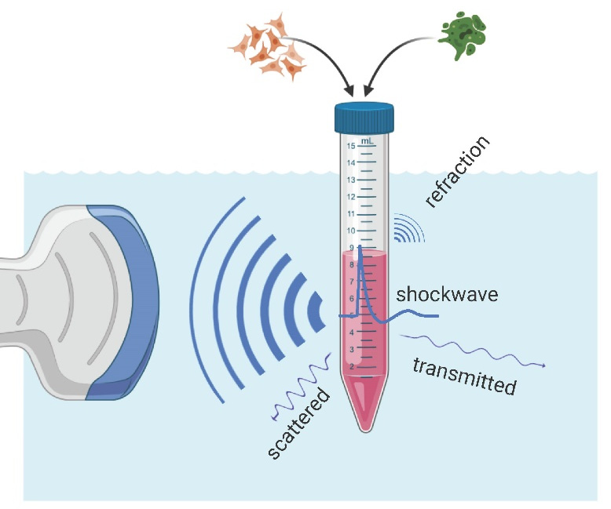

> of electrohydraulic devices. This allows for the systematic
> investigation of the energy and pressure-dependent impact of utilized
> cell containers. Experimental measurement data is presented from an
> electrohydraulic applicator (OP 155 connected to an Orthogold 100
> device, MTS Medical, Konstanz, Germany) and an electromagnetic device
> (DUOLITH SD1 «ultra», Storz Medical, Tägerwilen, Switzerland) with the
> “Sepia” handpiece. Each device was attached to a water bath and
> coupled directly to the water by only the stan-dard membrane.
>
> 4.2. Water Bath
>
> The key aims of the in vitro experiments are to either establish a
> correlation between physical shockwave parameters and biological
> responses of the studied cell and/or tissue samples or to apply a well
> understood and replicable treatment in the investigation of causation.
> This requires a well-described environment that should also resemble
> the physical characteristics of the clinical application. While a
> homogenous medium, free of
>
> *Int.* *J.* *Mol.* *Sci.* **2022**, *22*, x FOR PEERreflection or
> refraction (free field), is desirable, the proximity effects of bones
> and tissue–air
>
> ~~interfaces should be systematically investigated. See Figure 10 for
> a schematic overview of~~
>
> an in vitro water bath setup.
>
> **Figure** **10..** Schematic overview of an in vitro
> experimentallsetup.. A shockwave applicator (left) generates a
> focusing acoustic wave which creates a strong shockwave inside the
> treatment zone of a bi-ological sample. The transmitted wave is
> attenuated throughout by complex scattering and absorption processes
> resulting in important refraction phenomena in the vicinity of
> air–liquid-interfaces.
>
> Intheuseofstronglyandweaklyfocusingreflectorgeometries,thestrongestpressures
> are only found in the proximity of the focal volume. Those peak
> pressures and associated high energy densities are created by the
> superposition of individual incident wavelets.
>
> After they pass through the focal area, they continue to radially
> diverge, losing intensity wavelets. After they pass through the focal
> area, they continue to radially diverge, losing
>
> geometries with an axial dimension of 20.cm for an applicator focal
> length of 4 cm. Thist
>
> assures the originalipulse will decay past the initial focus due to
> absorptionlwithin the cm. i This assures thee original pulse l will
> decay past theiinitial focus duelto absorption within the medium and
> will have dissipated well before the application of the next pulse.
>
> complexity of correlating with physical parameters in the area of
> interest. Shockwaves con-
>
> tthe complexity of correlating with physical parameters in the area of
> interest. Shockwaves
>
> continually move through a medium only subject to a
> frequency-dependent absorption, sound.
> Weusevacuumejectordegassedroomtemperaturewaterat\<10%dissolvedoxygen
>
> saturation to reduce the likelihood of cavitation and improve pulse
> transmission. However,
>
> dissolved oxygen saturation to reduce the likelihood of cavitation and
> improve pulse transmission. However, any change in impedance of the
> medium will result in a partial reflection and transmission of the
> wave front, impacting the pressures and directions of the propagating
> waves.
>
> Of particular concern are reflections on air interfaces (high to low
> impedance
>
> discontinuity) in the vicinity of the wave’s acoustical path. These
> lead to an almost

Int. J. Mol. Sci. **2022**, 23, 313 13 of 16

> any change in impedance of the medium will result in a partial
> reflection and transmission of the wave front, impacting the pressures
> and directions of the propagating waves.
>
> Of particular concern are reflections on air interfaces (high to low
> impedance discon-tinuity) in the vicinity of the wave’s acoustical
> path. These lead to an almost complete reflection of the incident wave,
> which incurs a phase inversion upon reflection. A conse-quentially
> enhanced tensile part of the wave, however, would only occur in the
> immediate vicinity of the interface (pressure zone) as no resonance
> effects occur with these single pulses, as we would see with
> continuous waves (i.e., ultrasound). We can estimate the size of this
> zone based on the pulse duration d which consists of a brief
> compressive pressure containing the shock front and a longer
> subsequent tensile pressure and tail oscillations. Using a
> conservative estimate of d = 5 s, we estimate the size of the pressure
> zone where we would expect enhanced tensile forces to extend no larger
> than 7.5 mm from the interface.
>
> An in vitro setup consisting of a water bath in which the biological
> samples are submerged has turned out as an ideal candidate to meet all
> challenges mentioned above. Short focal lengths (\<10 cm) only require
> small tank sizes to achieve an effective free field
> zone,asanyreflectionsoccurringonthebathboundarieswillbeweakand,intheabsenceof
> a refocusing tank-geometry, neglectable. As such, there is no
> additional need for absorbing boundary layers or “wave-breakers” to
> achieve a genuinely reflection-free environment. Any samples and
> containers of comparable acoustic impedance can now be studied in an
> approximate free field. A similar approach has been adapted for an in
> vivo mouse model using a “diver box” to create a mostly reflection-free
> sound field \[28\].
>
> 4.3. Sound Measurements
>
> The international standard IEC 61846 allows for the use of either
> laser optic fibers or polyvinylidene fluoride (PVDF) hydrophones in the
> characterization of shock wave pressure fields. In opting for PVDF
> hydrophones, we are able to obtain repeated, local-ized in situ
> measurements at high pulse repetition frequencies. Pressure
> measurements were recorded with a Müller-Platte Needle Probe PVDF
> hydrophone (Dr. Müller Instru-ments, Oberursel, Germany) with a
> pressure range from 10 to 150 MPa and bandwidth from 0.3 to 11 MHz 3.0
> dB Data collection was done using a digital storage oscilloscope
> (4-channel, 100 MHz bandwidth, DS1104Z Plus, Rigol, Beijing, China).
> All hydrophone measurements for the characterization of the in situ
> sound fields are taken inside a water bath which was mounted onto a
> compound table to enable centering of the hydrophone in the
> applicator’s focal zone with regards to all three spatial dimensions.
>
> 4.4. Imaging
>
> Beyond point-wise hydrophone measurements, there is no direct way of
> quantifying the entire acoustic sound field. Quasi-quantitative
> Schlieren-based visualization techniques have emerged but are not yet
> a viable option. While for electromagnetic and piezo devices, a
> volumetric mapping may be possible, the stochastic nature of
> electrohydraulic devices prohibits such an approach. Shadowgraph,
> Schlieren, and interferometry imaging methods provide a qualitative
> look at wave propagation and sound field geometries. Resultant images
> are plane-specific or integrative over the volume and provide no
> information on local pressures. However, they are a great tool for
> investigating the effects of reflection and refraction of samples that
> are introduced into the free-field water bath. In clearly being able to
> identify regions of concern in vitro, researchers may modify their
> setup or provide further geometric acoustic parameters.
>
> In our setup, we employed an optical phase contrast detection (OPCD)
> method, wherein the resultant contrast is proportional to the
> integrated pressure over the depth of the viewing plane. An optically
> expanded diode-pumped solid-state laser (wavelength 527 nm, 8 ns pulse
> duration, Laser-compact group, Moscow, Russia) illuminated the water
> bath perpendicular to the main axis of the shockwave generator. The
> pressure variations of the shockwave pulse resulted in a proportional
> phase shift of the irradiating light. A subsequent projection onto an
> optical phase plate provided a measurable intensity

Int. J. Mol. Sci. **2022**, 23, 313 14 of 16

> modulated image of the integrated field which was recorded by a 2D
> array detector using a 14-bit CCD camera (Type: pco.2000s, PCO AG,
> Munich, Germany). Further details of the setup can be found in
> \[29,30\].
>
> 4.5. Cell Preparation
>
> In a controlled study of biophysical phenomena, special considerations
> have to be
> madetoestablishaclearcorrelationofphysicalandbiologicalparameters.
> Thiscanbecome particularly challenging if cell models cannot be
> reduced in size to approximately half the
>
> 6dBfocalvolumewhereauniformacousticfieldapproximationmaybemade\[17\].
> Using cell sedimentation as a means of localizing cells within the
> focal volume, a suspected subse-quent re-mixing during ESWT
> application was explored by monitoring cell distribution within filled
> Falcon tubes (Greiner, Kremsmünster, Austria).
>
> Our in vitro setup utilized human adipose-derived stromal cells (ASC)
> isolated from the stromal vascular fraction (SVF). In addition to
> ASCs, the SVF included a variety of different cell types from the
> surrounding tissue; endothelial cells, pericytes, erythrocytes,
> lymphocytes, monocytes, fibroblasts, macrophages, and adipocytes
> \[31,32\]. After liposuc-tion of subcutaneous adipose tissue, the
> lipoaspirate was cleaned and processed from the Red Cross Blood
> Transfusion Service of Upper Austria in Linz, to isolate the SVF. The
> collection of human adipose tissue was approved by the local ethical
> board with written patient consent. Subcutaneous adipose tissue was
> obtained during routine outpatient liposuction procedures under local
> tumescence anesthesia. Cells were procured following the established
> protocol found in \[33\]. The SVF is stored at 80 degree until
> expansion.
>
> In preparation for use in sedimentation experiments 1.0 106 cells were
> thawed in a medium flask (T75, Greiner, Kremsmünster, Austria). Cells
> were used in passage 4 and were cultivated under standard cell culture
> conditions (37 C, 5% CO2) in endothelial cell growth medium BulletKit
> (EGM-2; Lonza, Basel, Switzerland) supplemented with 5% fetal calf
> serum (FCS). On day three, the cells reached a confluency of over 70%.
> After harvesting the cells, we resuspended them to a concentration of
> 5 105 cells/5 mL and transferred them into a 15 mL Falcon tube.
>
> **5.** **Conclusions**
>
> A successful search of a causal bio-physical mechanism requires a
> reliable and com-plete spatial and temporal description of physical
> shockwave parameters. We illustrate the stochastic nature of a low-mid
> energy electrohydraulic device which necessitates a statistical
> approach to in vitro setup characterizations. Device-specific free-field
> measure-ments are inadequate to capture actual local sound parameters,
> which are affected by local variations in impedance brought about by
> samples, containers, and possibly present air interfaces. This can be
> addressed by directly measuring the applied shockwaves within the
> sample, thus providing a more complete physical description. PVDF
> hydrophones in conjunction with suitable storage oscilloscopes provide
> a simple and affordable means to ascertain the desired physical
> parameter. Based on an understanding of the overall sound fields,
> researchers may devise an experimental treatment plan for applied
> energies, pulse repletion frequencies, sample volumes, and minimal
> treatment pulse numbers to assure statistical comparability.
>
> Final experimental plans are best evaluated additionally by clinicians
> to assure clinical relevance on the one hand and physicists for basic
> science guidance on the other hand. By
> followingoursuggestions,experimentaldatainthefieldofshockwavetherapywillbecome
> increasingly reproducible and comparable. As the search for an
> underlying mechanism and associated physical properties continues, we
> remain confident that our dedicated research community will greatly
> benefit from thorough and robust physical characterizations of in vitro
> experiments.
>
> **Author** **Contributions:** Conceptualization, C.S., R.R., D.H. and
> P.S.; Formal analysis, C.S.; Funding acquisition, P.S.; Investigation,
> C.S., R.R., J.M.J. and R.N.; Methodology, C.S., R.R., J.M.J. and R.N.;
> Project administration, C.S., D.H. and P.S.; Supervision, C.S. and
> P.S.; Visualization, R.N.; Writing—

Int. J. Mol. Sci. **2022**, 23, 313 15 of 16

> original draft, C.S.; Writing—review & editing, D.H. and P.S. All
> authors have read and agreed to the published version of the
> manuscript.
>
> **Funding:** This research received no external funding.
>
> **InstitutionalReviewBoardStatement:**
> ThestudywasconductedinaccordancewiththeDeclaration of Helsinki, and
> approved by the Ethikkommission des Landes Oberösterreich on 19 May
> 2014.
>
> **Informed** **Consent** **Statement:** Patient consent was waived due
> to secondary use of specimens.
>
> **Data** **Availability** **Statement:** The data presented in this
> study are available on request from the corresponding author. The data
> are not publicly available due to potential conflicts of
> confidentiality.
>
> **Acknowledgments:** We express our gratitude for funding provided by
> the Austrian Science Fund (FWF), project P28032. In addition, we thank
> MTS Medical and Storz Medical for generously providing the technical
> equipment. BioRender.com (accessed 2021) was used in the creation of
> the illustrative graphics.
>
> **Conflicts** **of** **Interest:** The authors declare no conflict of
> interest.

**References**

1\. Heller, K.D.; Niethard, F.U. Der einsatz der extrakorporalen
stosswellentherapie in der orthopadie—Eine metaanalyse. Z. Fur Orthop.
Und Ihre Grenzgeb. **1998**, 136, 390–401.
[\[CrossRef\]](http://doi.org/10.1055/s-2008-1053674)
[\[PubMed\]](http://www.ncbi.nlm.nih.gov/pubmed/9823633)

2\. Schaden, W.; Fischer, A.; Sailler, A. Extracorporeal Shock Wave
Therapy of Nonunion or Delayed Osseous Union. Clin. Orthop. Relat. Res.
**2001**, 387, 90–94.
[\[CrossRef\]](http://doi.org/10.1097/00003086-200106000-00012)
[\[PubMed\]](http://www.ncbi.nlm.nih.gov/pubmed/11400900)

3\. Lohrer, H.; Schöll, J.; Arentz, S. Achilles Tendinopathy and
Patellar Tendinopathy. Results of Radial Shockwave Therapy in Patients
with Unsuccessfully Treated Tendinoses. Sportverletz. Sportschaden
**2002**, 16, 108–114.
[\[CrossRef\]](http://doi.org/10.1055/s-2002-34752)
[\[PubMed\]](http://www.ncbi.nlm.nih.gov/pubmed/12382183)

4\. Weihs, A.M.; Fuchs, C.; Teuschl, A.H.; Hartinger, J.; Slezak, P.;
Mittermayr, R.; Redl, H.; Junger, W.G.; Sitte, H.H. Shockwave treatment
enhances cell proliferation and improves wound healing by ATP release
coupled extracellular signal-regulated kinase (ERK) activation. J. Biol.
Chem. **2014**, 289, 27090–27104.
[\[CrossRef\]](http://doi.org/10.1074/jbc.M114.580936)
[\[PubMed\]](http://www.ncbi.nlm.nih.gov/pubmed/25118288)

5\.
Hausner,T.;Pajer,K.;Halat,G.;Hopf,R.;Schmidhammer,R.;Redl,H.;Nógrádi,A.Improvedrateofperipheralnerveregeneration
induced by extracorporeal shock wave treatment in the rat. Exp. Neurol.
**2012**, 236, 363–370.
[\[CrossRef\]](http://doi.org/10.1016/j.expneurol.2012.04.019)
[\[PubMed\]](http://www.ncbi.nlm.nih.gov/pubmed/22575596)

6\. Lobenwein, D.; Tepeköylü, C.; Kozaryn, R.; Pechriggl, E.J.; Bitsche,
M.; Graber, M.; Fritsch, H.; Semsroth, S.; Stefanova, N.; Paulus, P.; et
al. Shock Wave Treatment Protects From Neuronal Degeneration via a
Toll-Like Receptor 3 Dependent Mechanism: Implications of a First-Ever
Causal Treatment for Ischemic Spinal Cord Injury. J. Am. Heart Assoc.
**2015**, 4, e002440.
[\[CrossRef\]](http://doi.org/10.1161/JAHA.115.002440)
[\[PubMed\]](http://www.ncbi.nlm.nih.gov/pubmed/26508745)

7\. Lohse-Busch, H.; Reime, U.; Falland, R. Symptomatic treatment of
unresponsive wakefulness syndrome with transcranially focused
extracorporeal shock waves. NeuroRehabilitation **2014**, 35, 235–244.
[\[CrossRef\]](http://doi.org/10.3233/NRE-141115)

8\. Rompe, J.D.; Rumler, F.; Hopf, C.; Nafe, B.; Heine, J. Extracorporal
shock wave therapy for calcifying tendinitis of the shoulder. Clin.
Orthop. Relat. Res. **1995**, 196–201.
[\[CrossRef\]](http://doi.org/10.1097/00003086-199512000-00030)

9\. Schaden, W.; Thiele, R.; Kölpl, C.; Pusch, M.; Nissan, A.; Attinger,
C.E.; Maniscalco-Theberge, M.E.; Peoples, G.E.; Elster, E.A.;
Stojadinovic, A. Shock wave therapy for acute and chronic soft tissue
wounds: A feasibility study. J. Surg. Res. **2007**, 143, 1–12.
[\[CrossRef\]](http://doi.org/10.1016/j.jss.2007.01.009)

10\. Hercher, D.; Redl, H.; Schuh, C.M.A.P. Motor and sensory Schwann
cell phenotype commitment is diminished by extracorporeal shockwave
treatment in vitro. J. Peripher. Nerv. Syst. **2020**, 25, 32–43.
[\[CrossRef\]](http://doi.org/10.1111/jns.12365)

11\. Schuh, C.M.A.P.; Hercher, D.; Stainer, M.; Hopf, R.; Teuschl, A.H.;
Schmidhammer, R.; Redl, H. Extracorporeal shockwave treatment: A novel
tool to improve Schwann cell isolation and culture. Cytotherapy
**2016**, 18, 760–770.
[\[CrossRef\]](http://doi.org/10.1016/j.jcyt.2016.03.002)

12\. Moya, D.; Ramón, S.; Schaden, W.; Wang, C.-J.; Guiloff, L.; Cheng,
J.-H. The Role of Extracorporeal Shockwave Treatment in Musculoskeletal
Disorders. J. Bone Jt. Surg. **2018**, 100, 251–263.
[\[CrossRef\]](http://doi.org/10.2106/JBJS.17.00661)

13\. Speed, C.A.; Nichols, D.; Wies, J.; Humphreys, H.; Richards, C.;
Burnet, S.; Hazleman, B.L. Extracorporeal shock wave therapy for plantar
fasciitis. A double blind randomised controlled trial. J. Orthop. Res.
**2003**, 21, 937–940.
[\[CrossRef\]](http://doi.org/10.1016/S0736-0266(03)00048-2)

14\. Cheng, J.-H.; Wang, C.-J. Biological mechanism of shockwave in
bone. Int. J. Surg. **2015**, 24, 143–146.
[\[CrossRef\]](http://doi.org/10.1016/j.ijsu.2015.06.059)

15\. Holfeld, J.; Tepeköylü, C.; Kozaryn, R.; Urbschat, A.; Zacharowski,
K.; Grimm, M.; Paulus, P. Shockwave Therapy Differentially Stimulates
Endothelial Cells: Implications on the Control of Inflammation via
Toll-Like Receptor 3. Inflammation **2014**, 37, 65–70.
[\[CrossRef\]](http://doi.org/10.1007/s10753-013-9712-1)

16\. Tepeköylü, C.; Primessnig, U.; Pölzl, L.; Graber, M.; Lobenwein,
D.; Nägele, F.; Kirchmair, E.; Pechriggl, E.; Grimm, M.; Holfeld, J.
Shockwaves prevent from heart failure after acute myocardial ischaemia
via RNA/protein complexes. J. Cell. Mol. Med. **2017**, 21, 791–801.
[\[CrossRef\]](http://doi.org/10.1111/jcmm.13021)

17\. Dietz-Laursonn, K.; Beckmann, R.; Ginter, S.; Radermacher, K.; de
la Fuente, M. In-vitro cell treatment with focused shockwaves-influence
of the experimental setup on the sound field and biological reaction. J.
Ther. Ultrasound **2016**, 4, 1–14.
[\[CrossRef\]](http://doi.org/10.1186/s40349-016-0053-z)
[\[PubMed\]](http://www.ncbi.nlm.nih.gov/pubmed/27030807)

Int. J. Mol. Sci. **2022**, 23, 313 16 of 16

18\. Schmitz, C.; Császár, N.B.M.; Milz, S.; Schieker, M.; Maffulli, N.;
Rompe, J.-D.; Furia, J.P. Efficacy and safety of extracorporeal shock
wave therapy for orthopedic conditions: A systematic review on studies
listed in the PEDro database. Br. Med. Bull. **2015**, 116, 115–138.
[\[CrossRef\]](http://doi.org/10.1093/bmb/ldv047)
[\[PubMed\]](http://www.ncbi.nlm.nih.gov/pubmed/26585999)

19\. Perez, C.; Chen, H.; Matula, T.J.; Karzova, M.; Khokhlova, V.A.
Acoustic field characterization of the Duolith: Measurements and modeling
of a clinical shock wave therapy device. J. Acoust. Soc. Am. **2013**,
134, 1663–1674. [\[CrossRef\]](http://doi.org/10.1121/1.4812885)

20\. Bachmann, C.E.; Gruber, G.; Konermann, W.; Arnold, A.; Gruber,
G.M.; Ueberle, F.; Gerdesmeyer, L. ESWT and Ultrasound Imaging of the
Musculoskeletal System; Steinkopff: Heidelberg, Germany, 2001; ISBN
978-3-7985-1252-8.
[\[CrossRef\]](http://doi.org/10.1007/978-3-642-48805-4)

21\. Loske, A.M. Applications of Shock Waves in Medicine. In Handbook of
Shock Waves; Elsevier: Amsterdam, The Netherlands, 2001; Volume 387, pp.
415–440. ISBN 0-12-086432-2.
[\[CrossRef\]](http://doi.org/10.1016/B978-012086430-0/50028-2)

22\. Wess, O.J. Physics and Technique of Shock Wave Lithotripsy (SWL).
In Urolithiasis; Springer London: London, UK, 2012; pp. 301–311.
[\[CrossRef\]](http://doi.org/10.1007/978-1-4471-4387-1_38)

23\. McClure, S.; Dorfmüller, C. Extracorporeal shock wave therapy:
Theory and equipment. Clin. Tech. Equine Pract. **2003**, 2, 348–357.
[\[CrossRef\]](http://doi.org/10.1053/j.ctep.2004.04.008)

24\. Cleveland,R.O.; McAteer,J.A.; Andreoli,S.P.;
Crum,L.A.Theeffectofpolypropylenevialsonlithotriptershockwaves.
Ultrasound Med. Biol. **1997**, 23, 939–952.
[\[CrossRef\]](http://doi.org/10.1016/S0301-5629(97)00026-4)

25\. Ogden, J.A.; Tóth-Kischkat, A.; Schultheiss, R. Principles of Shock
Wave Therapy. Clin. Orthop. Relat. Res. **2001**, 387, 8–17.
[\[CrossRef\]](http://doi.org/10.1097/00003086-200106000-00003)
[\[PubMed\]](http://www.ncbi.nlm.nih.gov/pubmed/11400898)

26\. Pishchalnikov, Y.A.; McAteer, J.A.; Williams, J.C., Jr. Effect of
firing rate on the performance of shock wave lithotriptors. BJU Int.
**2008**, 102, 1681–1686.
[\[CrossRef\]](http://doi.org/10.1111/j.1464-410X.2008.07896.x)

27\. Pishchalnikov, Y.A.; Williams, J.C.; McAteer, J.A. Bubble
proliferation in the cavitation field of a shock wave lithotripter. J.
Acoust. Soc. Am. **2011**, 130, EL87–EL93.
[\[CrossRef\]](http://doi.org/10.1121/1.3609920)
[\[PubMed\]](http://www.ncbi.nlm.nih.gov/pubmed/21877776)

28\. Sorg, H.; Tilkorn, D.J.; Kolbenschlag, J.; Zwetzich, I.; Hauser,
J.; Goertz, O.; Spindler, N.; Langer, S.; Ring, A. A Novel Technique for
the Standardized Application of Shock Waves in Experimental Research:
The Diver Box. Ultrasound Med. Biol. **2018**, 44, 1563–1568.
[\[CrossRef\]](http://doi.org/10.1016/j.ultrasmedbio.2018.03.006)
[\[PubMed\]](http://www.ncbi.nlm.nih.gov/pubmed/29699718)

29\. Pitts, T.A.; Sagers, A.; Greenleaf, J.F. Optical phase contrast
measurement of ultrasonic fields. IEEE Trans. Ultrason. Ferroelectr.
Freq. Control **2001**, 48, 1686–1694.
[\[CrossRef\]](http://doi.org/10.1109/58.971722)
[\[PubMed\]](http://www.ncbi.nlm.nih.gov/pubmed/11800132)

30\. Nuster, R.; Slezak, P.; Paltauf, G. High resolution
three-dimensional photoacoustic tomography with CCD-camera based
ultrasound detection. Biomed. Opt. Express **2014**, 5, 2635.
[\[CrossRef\]](http://doi.org/10.1364/BOE.5.002635)

31\. Brown, J.C.; Katz, A.J. Stem Cells Derived From Fat. In Principles
of Regenerative Medicine; Elsevier: Amsterdam, The Netherlands, 2019;
pp. 295–305.
[\[CrossRef\]](http://doi.org/10.1016/B978-0-12-809880-6.00019-9)

32\. Ramakrishnan, V.M.; Boyd, N.L. The Adipose Stromal Vascular
Fraction as a Complex Cellular Source for Tissue Engineering
Applications. Tissue Eng. Part B Rev. **2018**, 24, 289–299.
[\[CrossRef\]](http://doi.org/10.1089/ten.teb.2017.0061)

33\. Priglinger, E.; Schuh, C.M.A.P.; Steffenhagen, C.; Wurzer, C.;
Maier, J.; Nuernberger, S.; Holnthoner, W.; Fuchs, C.; Suessner, S.;
Rünzler, D.; et al. Improvement of adipose tissue–derived cells by
low-energy extracorporeal shock wave therapy. Cytotherapy **2017**, 19,
1079–1095. [\[CrossRef\]](http://doi.org/10.1016/j.jcyt.2017.05.010)
